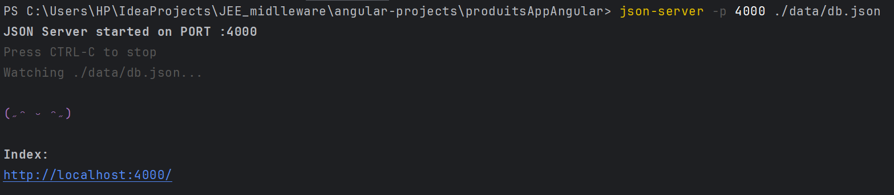
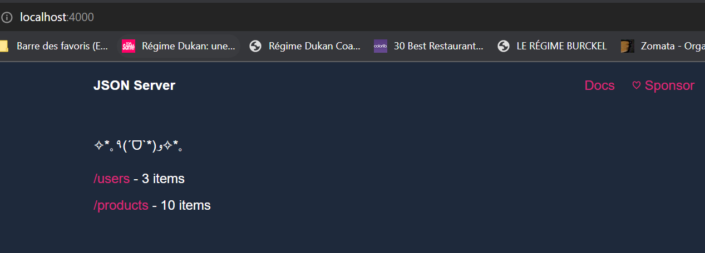
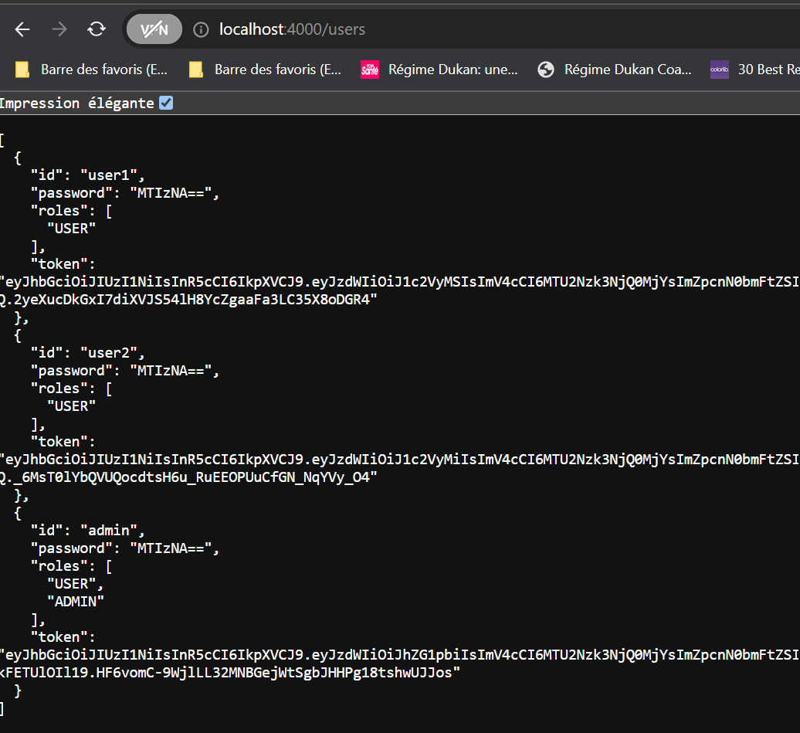
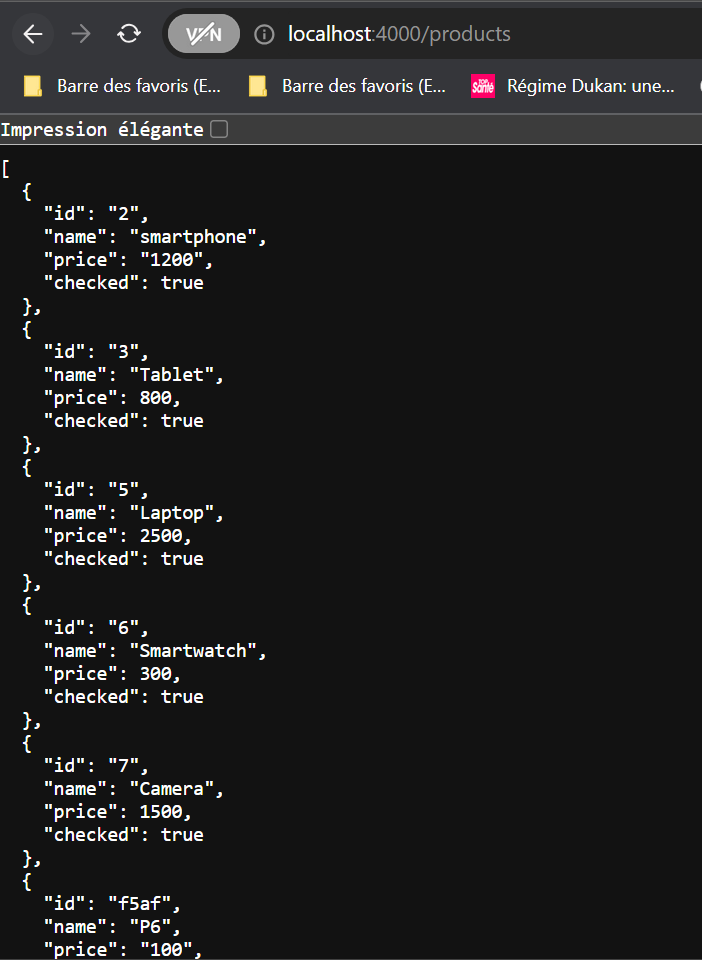
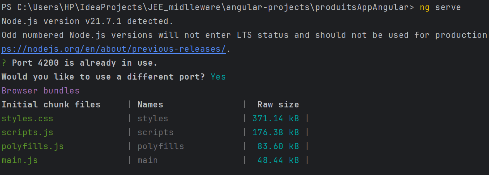
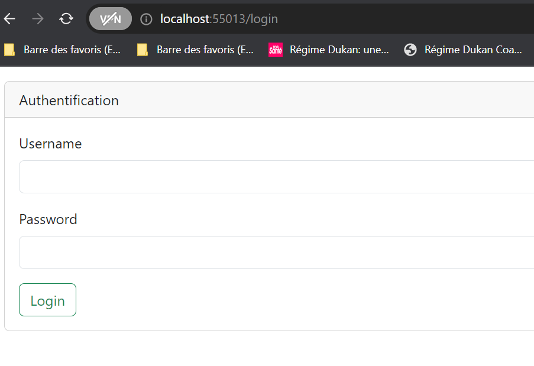
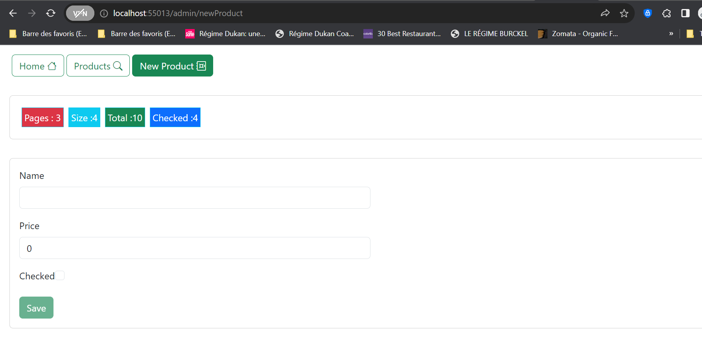
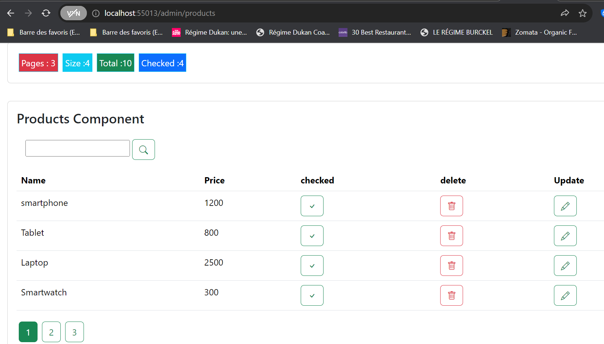
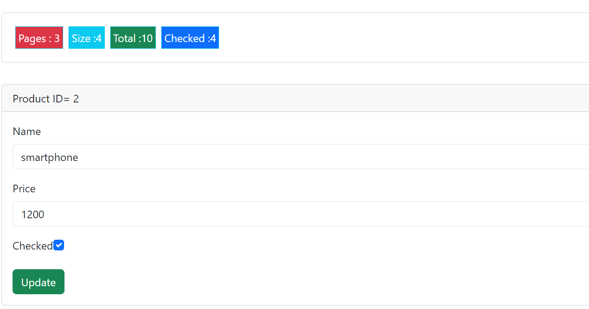

<h2>Tp-Application de Gestion de Produits avec Angular et JSON Server</h2>
<h4>Réaliser par Maryam Nfad 
<h6>Cette application web Angular permet de gérer des produits en utilisant un backend basé sur JSON Server. Elle offre des fonctionnalités de visualisation, d'ajout, de modification et de suppression de produits.
<h3>Installation
<h6>
1- Assurer  d'avoir Node.js installé sur votre machine.
2-Exécuter npm install pour installer les dépendances.</h6>
<h3>Démarrage du Backend (JSON Server)
<h6> db.json fichier JSON contenant les données des produits .
Exécuter json-server db.json pour démarrer le serveur JSON.

<h3>Démarrage de l'Application Angular
<h6>1-Exécuter ng serve pour démarrer l'application Angular.
<h6>2-accéder à http://localhost:{port-utilisé}/ pour voir l'application en action.

<h3>Fonctionnalités
<h6>Visualisation des Produits: Affiche une liste de tous les produits disponibles.
<h6>Ajout de Produits: Permet d'ajouter de nouveaux produits avec leurs détails.
<h6>Modification de Produits: Permet de modifier les détails des produits existants.
<h6>Suppression de Produits: Permet de supprimer des produits de la liste.

<h3>Technologies Utilisées
<h6>Angular
<h6>JSON Server
<h6>Bootstrap (pour l'interface utilisateur)
